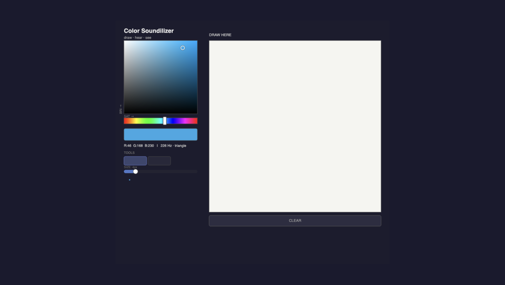
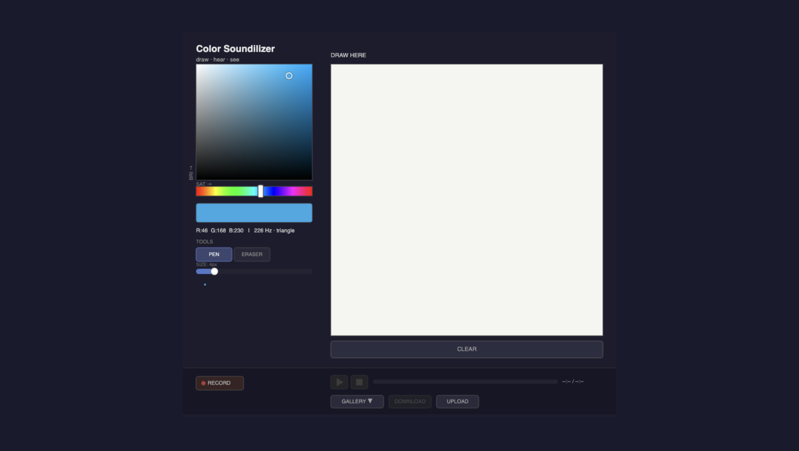

# Color Soundilizer

_By Adam Hacker_

<!-- HERO IMAGE: Add a screenshot or photo of the app here -->
<!--  -->

> A creative tool that connects color to sound :)

---

## Showcase / Description of Finished Piece

<!-- Add screenshots or a screen recording of the app in action here -->

**Full Demo Video:** TO BE ADDED<!-- [Link to video]() -->

Color Soundilizer is an interactive web app where drawing and sound are tied together, 1:1. Use an HSB color picker and then draw on the canvas. As you paint, the web app synthesizes a tone for you to hear. Hue maps to pitch, with saturation and brightness managing the timbre. The result is a connection between both the visual and audible dimensions of your life.

The app includes a full **recording and playback system**, where you can capture a drawing session (strokes, timing, and all the color changes) and replay it like a performance. Recordings can be saved to local storage, exported as JSON files, and loaded back in, building up a personal gallery of color-sound compositions.

**Key features:**

- HSB color picker with hue strip and live swatch preview
- Pen, eraser, and fill tools with adjustable brush size
- Real-time audio synthesis tied to the active color
- Record and play back full drawing sessions with timing
- Pause, resume, and scrub through playback via a progress bar
- Save/load recordings to localStorage; export and import as `.json` files
- In-app gallery to browse and re-open saved recordings

---

## Process

### Ideation / Design Process

<!-- Add sketches, mood board, inspiration images, early wireframes here -->
<!--   -->

This project started by asking the question: what 2 dimensions can I connect that normally aren't?

My initial thinking brought me to the neurological phenomenon "synesthesia", where some people can percieve colors as sounds (and vice versa). I then wondered if I could create a tool that would connect color and sound in a 1:1 mapping.

I first thought about using pre-recorded sounds or samples, but after realising that I can map color to sound in a 1:1 mapping, I decided to synthesize the audio live.

### Prototyping / Building Process

<!-- Add in-progress screenshots, prototype photos, iteration images here -->
<!--   -->

The project was built as a single self-contained HTML file using **p5.js** for rendering and the browser's native **Web Audio API** for synthesis. This allows practically any device to run this code.

My first prototype focused on getting the general idea across.

Above, you can see one of my first drafts. The color selector is placed on the left, with various other mechanisms that control the interactivity of the canvas, including a "Clear" button at the bottom.

However, after some feedback from peers in class, I decided that this tool could be much more intuitive and efficient to use. For example, it would be nice to have an "eraser" that can be used, instead of having to clear the entire canvas after every mistake.

Also, since the project is "Sound for Someone", there should be a way to save and share the music/color files with other people.

The screenshot above shows a finalized version of my project, which includes the changes mentioned prior. It includes an "eraser" tool as well as a playback/recording toolkit on the bottom.

---

## Conclusion / Reflection

<!-- You can also add images or video clips here that capture the feeling of the piece -->

<!-- [Write your reflection here] -->

With this piece, I really wanted to create a tool where the user could create their own artwork to give to others. However, I knew I had to "unlock" a new dimension of expression that isn't typically availble. For me, this was the connection between color and sound.

As described above, there were many iterations to this piece. Most of them were refining the specific mapping between color and sound, as well as adding quality-of-life changes. Most of these suggestions were at the advice of peers in the class, so it was nice to learn/realize how important feedback is within the design process.

Overall, I had an amazing time on this project!

---
